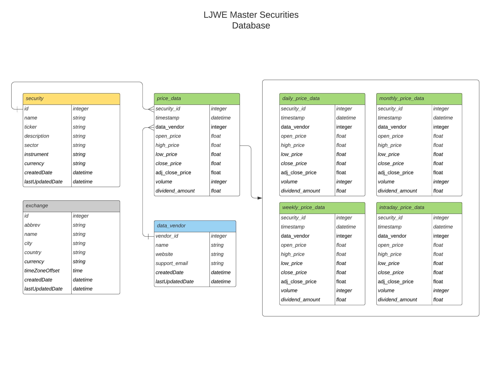

# LJWE Database

Database setup and management scripts for LJWE trading system. Utilizes `alembic` to track revisions to database schema. Currently pulls data from Alpha Vantage in the following formats: intraday, daily, weekly, monthly. Data is reformatted using `pandas` and committed to the database using `SQLAlchemy`.

